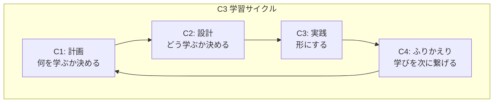

# C3サイクルとは？ (コンセプトガイド)

## 1. なぜ、このフレームワークが必要なのか？ (Why)

多くの学習は、以下のような課題に直面します。

*   **知識の蒸発:** 本を読んだ直後は「分かったつもり」でも、1週間後には内容を思い出せない。
*   **行動との断絶:** 知識は得たものの、いざ実践しようとすると、どこから手をつけて良いか分からない。
*   **目的の形骸化:** 学習を始めるが、日々の忙しさの中で当初の目的を見失い、モチベーションが続かない。

C3サイクルは、これらの課題を解決し、**「インプットした知識を、使えるスキルや具体的な成果物に変える」**ために設計された、シンプルな学習の"型"です。

---

## 2. C3サイクル 全体像 (What)

C3サイクルは、4つのフェーズを順番に進め、最後に最初のフェーズに戻ってくる「円」のような構造をしています。

`C4:ふりかえり` で得た気づき (`Try`) が、次の `C1:計画` の種となり、学習が螺旋状に成長していくのが最大の特徴です。

---

## 3. 各フェーズの役割 (How)

それぞれのフェーズを、料理に例えてみましょう。

### 📄 C1: Concept (計画)
> **役割:** 「何を作るか」を決め、レシピを読む

学習という航海の「地図」を描くフェーズです。

*   **問い:** 「何を」「なぜ」学ぶのか？
*   **やること:** 学習のゴールを設定し、大まかな手順を考えます。
*   **成果物:** `C1_PLAN.md` (学習計画書)

### 🗣️ C2: Conversation (設計)
> **役割:** シェフ(AI)に相談し、調理手順を具体的に決める

計画の解像度を上げ、具体的なアクションに落とし込むフェーズです。

*   **問い:** 「どのように」学び、「どう」アウトプットするのか？
*   **やること:** AIとの対話を通じて、計画の妥当性を確認し、最終的な成果物の「設計図」を作ります。
*   **成果物:** `C2_DESIGN.md` (成果物の設計書)

### ✍️ C3: Code / Craft (実践)
> **役割:** 実際にキッチンに立ち、料理を作り、**完成品をシェフ(AI)にレビューしてもらう**

知識を具体的な「形」にする、サイクルの中で最も重要なフェーズです。

*   **問い:** 学んだことを「形」にすると、どうなるか？
*   **やること:** 設計図を元に、目に見える成果物を自らの手で創り上げ、**完成したらAIに提示して、客観的なフィードバックを求めます。**
*   **成果物:** `C3_OUTPUT.md` (完成した料理) **と、それに対するAIからのレビュー**

###  🤔 C4: Retrospective (ふりかえり)
> **役割:** **シェフのレビューも踏まえて**料理を味わい、次のレシピを考える

今回の学習サイクル全体を客観的に評価し、次に繋げるフェーズです。

*   **問い:** このサイクルから何を学び、次にどう活かすか？
*   **やること:** **AIからのフィードバックも重要な材料としながら**、KPT法などを用いて、学習プロセス自体の良かった点(Keep)や課題(Problem)を洗い出し、次回の改善アクション(Try)を決めます。
*   **成果物:** `C4_RETROSPECTIVE.md` (次のサイクルへの引継書)

---

このサイクルを繰り返すことで、あなたの学習は一つ一つが分断された点ではなく、連続し、成長していく一本の線となります。